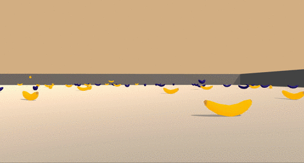

# Deep Reinforcement Learning project: navigation

Author: srikanth  
GitHub: https://github.com/srikaanthh

## Project details

In this project, an agent is trained to solve an environment in which it should collect as many yellow bananas avoiding the blue ones as possible.

A reward of +1 is provided for collecting a yellow banana, and a  reward of -1 is provided for collecting a blue banana.  Thus, the goal  of the agent is to collect as many yellow bananas as possible while  avoiding blue bananas.  

The state space has 37 dimensions and contains the agent's velocity,  along with ray-based perception of objects around the agent's forward  direction.  Given this information, the agent has to learn how to best  select actions.  Four discrete actions are available, corresponding to:

- **`0`** - move forward.
- **`1`** - move backward.
- **`2`** - turn left.
- **`3`** - turn right.

The task is episodic, and in order to solve the environment, the  agent must get an average score of +13 over 100 consecutive episodes.

## Getting started

1. Follow the instructions given [here](https://github.com/udacity/deep-reinforcement-learning#dependencies) to install all the dependencies.

2. Download the environment for your OS:

   * Linux: [click here](https://s3-us-west-1.amazonaws.com/udacity-drlnd/P1/Banana/Banana_Linux.zip)

   * Mac OS: [click here](https://s3-us-west-1.amazonaws.com/udacity-drlnd/P1/Banana/Banana.app.zip)
   * Windows (32-bit): [click here](https://s3-us-west-1.amazonaws.com/udacity-drlnd/P1/Banana/Banana_Windows_x86.zip)
   * Windows (64-bit): [click here](https://s3-us-west-1.amazonaws.com/udacity-drlnd/P1/Banana/Banana_Windows_x86_64.zip)

3. Place the file in the root of the folder and unzip it.

4. Run it! Consider to change the cell at point 2 of the notebook to match with your folder `env = UnityEnvironment(file_name='Banana_Linux/Banana.x86_64')`.

## Instructions

If you want to train the agent, run the cells from the point 1 to the point 6 at [Deep_Q_Network.ipynb](Deep_Q_Network.ipynb). If you just want to execute the trained agent, run the cells from the point 1 to the point 4 plus the 7 at the notebook, since they load the weights of the network ([checkpoint.pth](checkpoint.pth)) for the trained agent. After running whatever you want, you can close the environment by running the cell at point 8.

Description of the implementation is in [Report.md](Report.md), but for more technical details, see the code at the notebook provided before.